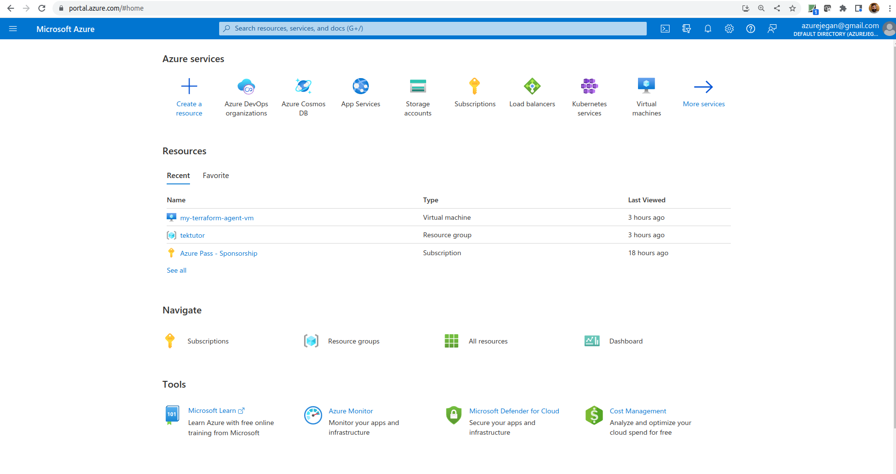
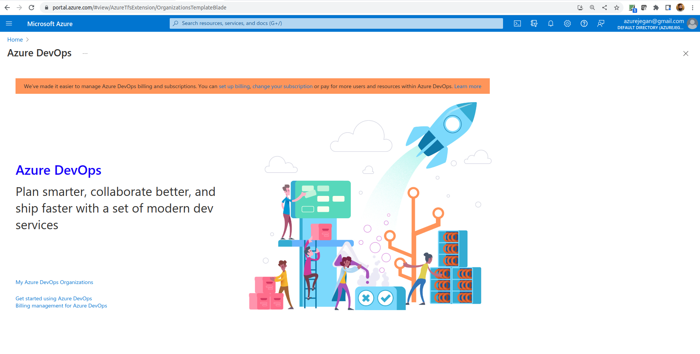
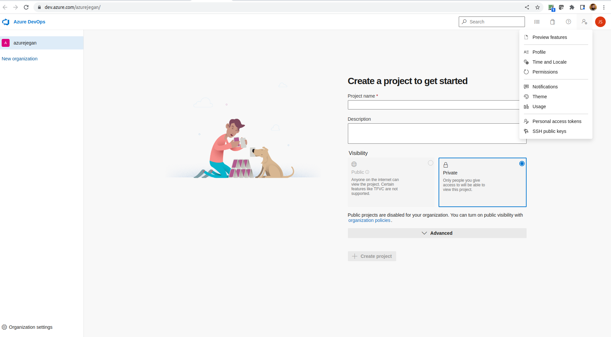

# Day 5

## Lab - Deploying a web application using Docker Image into the App Service
```
cd ~/terraform-nov-2022
git pull

cd /Day3/AppService/docker-basic
terraform init
terraform apply --auto-approve
```

Expected output
<pre>
(jegan@tektutor.org)$ <b>terraform init</b>

Initializing the backend...

Initializing provider plugins...
- Reusing previous version of hashicorp/azurerm from the dependency lock file
- Using previously-installed hashicorp/azurerm v3.33.0

Terraform has been successfully initialized!

You may now begin working with Terraform. Try running "terraform plan" to see
any changes that are required for your infrastructure. All Terraform commands
should now work.

If you ever set or change modules or backend configuration for Terraform,
rerun this command to reinitialize your working directory. If you forget, other
commands will detect it and remind you to do so if necessary.

(jegan@tektutor.org)$ <b>terraform apply --auto-approve</b>
var.location
  The Azure location where all resources in this example should be created

  Enter a value: <b>eastus</b>

var.prefix
  The prefix used for all resources in this example

  Enter a value: <b>tektutor</b>


Terraform used the selected providers to generate the following execution plan. Resource actions are indicated with the
following symbols:
  + create

Terraform will perform the following actions:

  # azurerm_linux_web_app.example will be created
  + resource "azurerm_linux_web_app" "example" {
      + app_settings                      = {
          + "WEBSITES_ENABLE_APP_SERVICE_STORAGE" = "false"
        }
      + client_affinity_enabled           = false
      + client_certificate_enabled        = false
      + client_certificate_mode           = "Required"
      + custom_domain_verification_id     = (sensitive value)
      + default_hostname                  = (known after apply)
      + enabled                           = true
      + https_only                        = false
      + id                                = (known after apply)
      + key_vault_reference_identity_id   = (known after apply)
      + kind                              = (known after apply)
      + location                          = "eastus"
      + name                              = "tektutor-example"
      + outbound_ip_address_list          = (known after apply)
      + outbound_ip_addresses             = (known after apply)
      + possible_outbound_ip_address_list = (known after apply)
      + possible_outbound_ip_addresses    = (known after apply)
      + resource_group_name               = "tektutor-resources"
      + service_plan_id                   = (known after apply)
      + site_credential                   = (known after apply)
      + zip_deploy_file                   = (known after apply)

      + auth_settings {
          + additional_login_parameters    = (known after apply)
          + allowed_external_redirect_urls = (known after apply)
          + default_provider               = (known after apply)
          + enabled                        = (known after apply)
          + issuer                         = (known after apply)
          + runtime_version                = (known after apply)
          + token_refresh_extension_hours  = (known after apply)
          + token_store_enabled            = (known after apply)
          + unauthenticated_client_action  = (known after apply)

          + active_directory {
              + allowed_audiences          = (known after apply)
              + client_id                  = (known after apply)
              + client_secret              = (sensitive value)
              + client_secret_setting_name = (known after apply)
            }

          + facebook {
              + app_id                  = (known after apply)
              + app_secret              = (sensitive value)
              + app_secret_setting_name = (known after apply)
              + oauth_scopes            = (known after apply)
            }

          + github {
              + client_id                  = (known after apply)
              + client_secret              = (sensitive value)
              + client_secret_setting_name = (known after apply)
              + oauth_scopes               = (known after apply)
            }

          + google {
              + client_id                  = (known after apply)
              + client_secret              = (sensitive value)
              + client_secret_setting_name = (known after apply)
              + oauth_scopes               = (known after apply)
            }

          + microsoft {
              + client_id                  = (known after apply)
              + client_secret              = (sensitive value)
              + client_secret_setting_name = (known after apply)
              + oauth_scopes               = (known after apply)
            }

          + twitter {
              + consumer_key                 = (known after apply)
              + consumer_secret              = (sensitive value)
              + consumer_secret_setting_name = (known after apply)
            }
        }

      + site_config {
          + always_on                               = true
          + container_registry_use_managed_identity = false
          + default_documents                       = (known after apply)
          + detailed_error_logging_enabled          = (known after apply)
          + ftps_state                              = "Disabled"
          + health_check_eviction_time_in_min       = (known after apply)
          + http2_enabled                           = false
          + ip_restriction                          = (known after apply)
          + linux_fx_version                        = (known after apply)
          + load_balancing_mode                     = "LeastRequests"
          + local_mysql_enabled                     = false
          + managed_pipeline_mode                   = "Integrated"
          + minimum_tls_version                     = "1.2"
          + remote_debugging_enabled                = false
          + remote_debugging_version                = (known after apply)
          + scm_ip_restriction                      = (known after apply)
          + scm_minimum_tls_version                 = "1.2"
          + scm_type                                = (known after apply)
          + scm_use_main_ip_restriction             = false
          + use_32_bit_worker                       = true
          + vnet_route_all_enabled                  = false
          + websockets_enabled                      = false
          + worker_count                            = (known after apply)

          + application_stack {
              + docker_image     = "jackofallops/azure-containerapps-python-acctest"
              + docker_image_tag = "v0.0.1"
            }
        }
    }

  # azurerm_resource_group.example will be created
  + resource "azurerm_resource_group" "example" {
      + id       = (known after apply)
      + location = "eastus"
      + name     = "tektutor-resources"
    }

  # azurerm_service_plan.example will be created
  + resource "azurerm_service_plan" "example" {
      + id                           = (known after apply)
      + kind                         = (known after apply)
      + location                     = "eastus"
      + maximum_elastic_worker_count = (known after apply)
      + name                         = "tektutor-sp-zipdeploy"
      + os_type                      = "Linux"
      + per_site_scaling_enabled     = false
      + reserved                     = (known after apply)
      + resource_group_name          = "tektutor-resources"
      + sku_name                     = "S1"
      + worker_count                 = (known after apply)
    }

Plan: 3 to add, 0 to change, 0 to destroy.

Changes to Outputs:
  + app_url            = (known after apply)
  + linux_web_app_name = "tektutor-example"
azurerm_resource_group.example: Creating...
azurerm_resource_group.example: Still creating... [10s elapsed]
azurerm_resource_group.example: Still creating... [20s elapsed]
azurerm_resource_group.example: Still creating... [30s elapsed]
azurerm_resource_group.example: Still creating... [40s elapsed]
azurerm_resource_group.example: Creation complete after 45s [id=/subscriptions/6ee542a8-0314-472f-a628-625cfbfcc778/resourceGroups/tektutor-resources]
azurerm_service_plan.example: Creating...
azurerm_service_plan.example: Still creating... [10s elapsed]
azurerm_service_plan.example: Creation complete after 13s [id=/subscriptions/6ee542a8-0314-472f-a628-625cfbfcc778/resourceGroups/tektutor-resources/providers/Microsoft.Web/serverfarms/tektutor-sp-zipdeploy]
azurerm_linux_web_app.example: Creating...
azurerm_linux_web_app.example: Still creating... [10s elapsed]
azurerm_linux_web_app.example: Still creating... [20s elapsed]
azurerm_linux_web_app.example: Still creating... [30s elapsed]
azurerm_linux_web_app.example: Still creating... [40s elapsed]
azurerm_linux_web_app.example: Creation complete after 46s [id=/subscriptions/6ee542a8-0314-472f-a628-625cfbfcc778/resourceGroups/tektutor-resources/providers/Microsoft.Web/sites/tektutor-example]

Apply complete! Resources: 3 added, 0 changed, 0 destroyed.

Outputs:

app_url = "https://tektutor-example.azurewebsites.net"
</pre>

## Azure App Service Plan SKU
<pre>
Free Tier → F1
Shared Tier → D1
Basic Tier → B1, B2, B3 (Basic Small, Medium, Large)
Standard Tier → S1, S2, S3 (Small, Medium, Large)
PremiumV2 Tier → P1v2, P2v2, P3v2 (Small, Medium, Large)
</pre>

## What is Continuous Integration (CI)?
- the code you wrote is integrated with dev branch several times a day, which triggers a build and automated test execution
- this ensures your code commit hasn't broken any existing functions as it runs your newly added test cases and existing test cases
- this is a fail-fast approach followed in teams that follow any Agile Frameworks( SCRUM, Kanban, XP, etc., )

## What is Continuous Delivery (CD)?
- is an extension of Continuous Integration (CI) since it automatically deploys all code changes to a testing and/or production environment after the build stage. 

- deploying and testing in multiple environments improves quality

## What is Continuous Deployment (CD)?
- goes one step further than continuous delivery
- With this practice, every change that passes all stages of your production pipeline is released to your customers 
- There's no human intervention, and only a failed test will prevent a new change to be deployed to production

## What is DevOps?
- is the combination of cultural philosophies, practices, and tools that increases an organization’s ability to deliver applications and services at high velocity
- enables organizations to better serve their customers and compete more effectively in the market

## Getting familiar with Azure Pipeline Jargons
- Azure Pipeline
- Stage
- Steps
- Trigger
- Job
- Agent
- Task
- Artifact

## What is Azure Pipeline?
- automatically builds and tests code projects to make them available to others
- it supports almost any programming language 
- combines continuous integration (CI) and continuous delivery (CD) to test and build your code and ship it to any target

## Azure Self-hosted agent binaries for all supported Operating Systems can be found here
<pre>
https://github.com/Microsoft/azure-pipelines-agent/releases
</pre>

## Lab - Creating a self-hosted Azure Pipeline agent to run Terraform scripts

#### Create a Personal Access Token
From your Azure portal, search for "Azure DevOps organizations" and click the same


You will see below page now, click on "My Azure DevOps Organizations"



Click on "Create new organization"

Once you have created your new organization, create a Personal Access Token with Full access and save the token in your system in some text file.  This token will be required to register your self-hosted pipeline agent with your project.


1. Provision an Ubuntu 20.04 Virtual Machine in your azure portal.
2. Install azure cli, terraform cli and ansible
```
sudo apt update
sudo apt install -y git ansible tree vim docker.io azure-cli
sudo snap install terraform --classic
sudo usermod -aG docker $USER
sudo su azureuser
docker images
```
3. From the terminal, type the below command, copy the code and paste the code on the web page that popped up and login to your azure portal to authenticate.
```
az login
```
Copy the credentials details in some file for your future reference.


4. Install the below from terminal to configure the Azure Ubuntu VM as a self-hosted Azure Pipline agent
```
mkdir myagent && cd myagent
wget https://vstsagentpackage.azureedge.net/agent/2.213.2/vsts-agent-linux-x64-2.213.2.tar.gz
tar zxvf vsts-agent-linux-x64-2.213.2.tar.gz
ls
./config.sh
./run.sh
```

Expected output
<pre>
azureuser@my-terraform-agent-vm:~/myagent$ <b>ls</b>
bin  config.sh  env.sh  externals  license.html  run-docker.sh  run.sh  vsts-agent-linux-x64-2.213.2.tar.gz
azureuser@my-terraform-agent-vm:~/myagent$ <b>./config.sh</b>

  ___                      ______ _            _ _
 / _ \                     | ___ (_)          | (_)
/ /_\ \_____   _ _ __ ___  | |_/ /_ _ __   ___| |_ _ __   ___  ___
|  _  |_  / | | | '__/ _ \ |  __/| | '_ \ / _ \ | | '_ \ / _ \/ __|
| | | |/ /| |_| | | |  __/ | |   | | |_) |  __/ | | | | |  __/\__ \
\_| |_/___|\__,_|_|  \___| \_|   |_| .__/ \___|_|_|_| |_|\___||___/
                                   | |
        agent v2.213.2             |_|          (commit 4f90e68)


>> End User License Agreements:

Building sources from a TFVC repository requires accepting the Team Explorer Everywhere End User License Agreement. This step is not required for building sources from Git repositories.

A copy of the Team Explorer Everywhere license agreement can be found at:
  /home/azureuser/myagent/license.html

Enter (Y/N) Accept the Team Explorer Everywhere license agreement now? (press enter for N) > <b>N</b>

>> Connect:

Enter server URL > https://dev.azure.com/azurejegan
Enter authentication type (press enter for PAT) > 
Enter personal access token > ****************************************************
Connecting to server ...

>> Register Agent:

Enter agent pool (press enter for default) > 
Enter agent name (press enter for my-terraform-agent-vm) > 
Scanning for tool capabilities.
Connecting to the server.
Successfully added the agent
Testing agent connection.
Enter work folder (press enter for _work) > 
2022-11-24 23:37:14Z: Settings Saved.

azureuser@my-terraform-agent-vm:~/myagent$ <b>./run.sh</b>
Scanning for tool capabilities.
Connecting to the server.
2022-11-25 00:15:55Z: Listening for Jobs
</pre>
